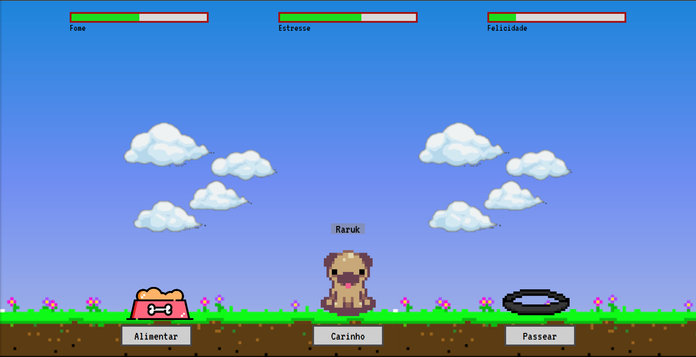

# Raruk 
> Um jogo de cuidar de um filhotinho.

 

 

    

  <h3 align="center">Raruk by <a href="https://www.linkedin.com/in/william-ferreira-3629a61b0/">William Ferreira</a></h3>
  

## Sobre 

Esse é um jogo simples onde seu objetivo é cuidar e de Raruk e deixa-ló feliz. Você pode fazer carinho, coloca-ló para correr e alimentar também.

Ele é bem intuitivo, então você não precisa de instruções exatas sobre o que fazer.

## Techs 

Esse jogo foi feito usando HTML5, CSS3 e JavaScript puros.

 

## Start

Para jogar basta acessar esse [link](https://raruk.vercel.app/) e pronto, caso queira dar uma olhada ou mexida no código, basta clonar esse repositório e abrir o arquivo `index.html`.

## Contact

Livre para entrar em contato ;)

Email: williamferreira132003@gmail.com

Linkedin: https://www.linkedin.com/in/william-ferreira-3629a61b0/

Discord: William Ferreira#0932